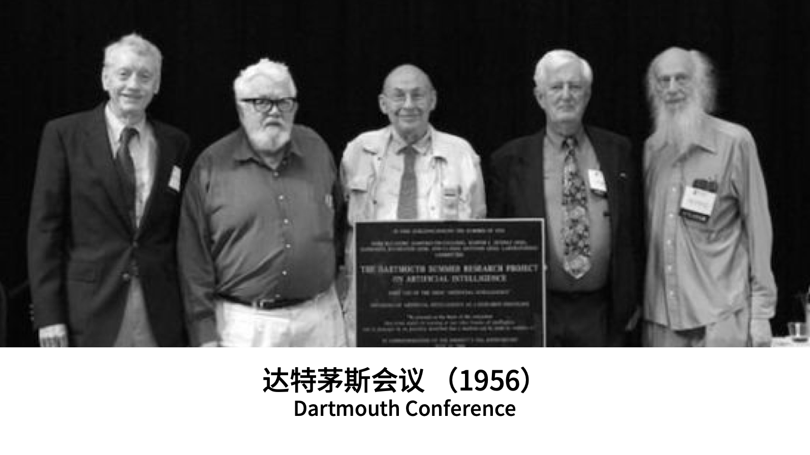
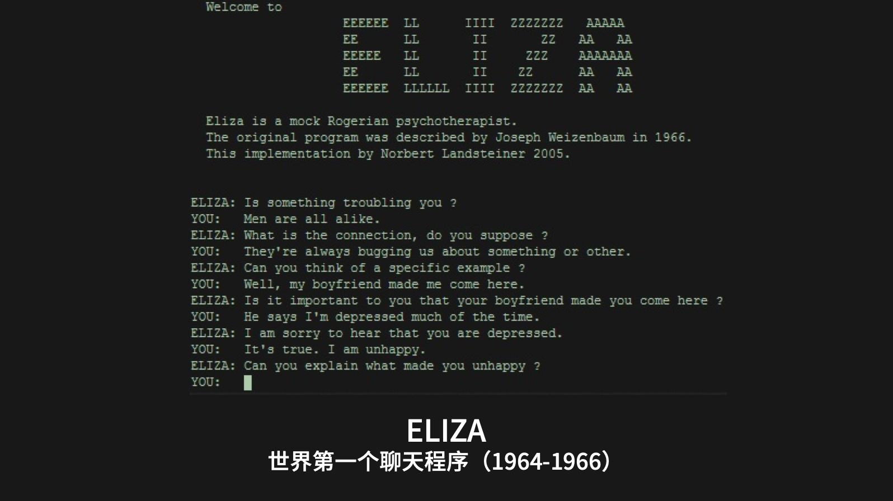
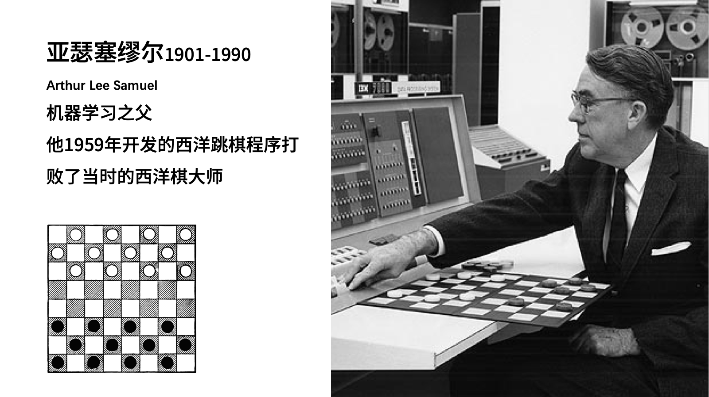
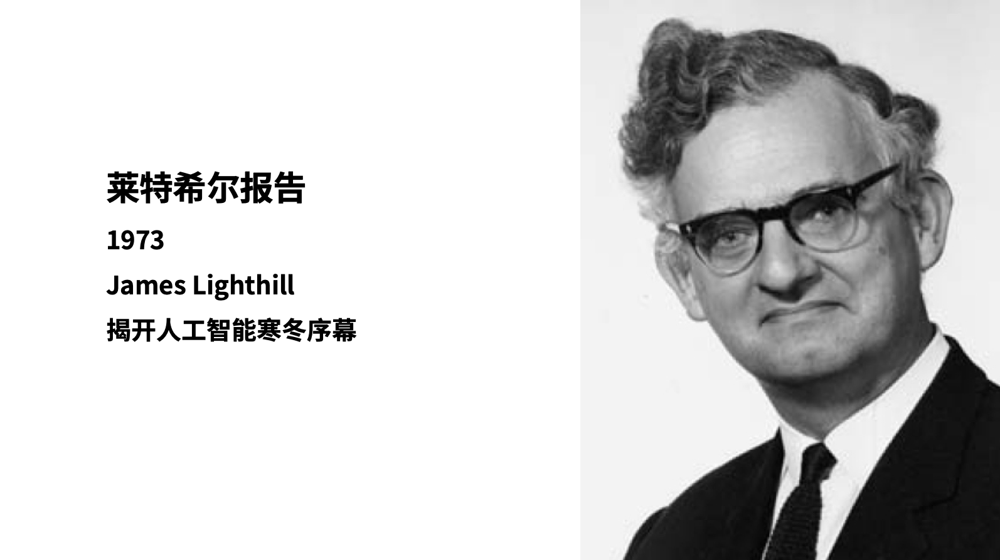
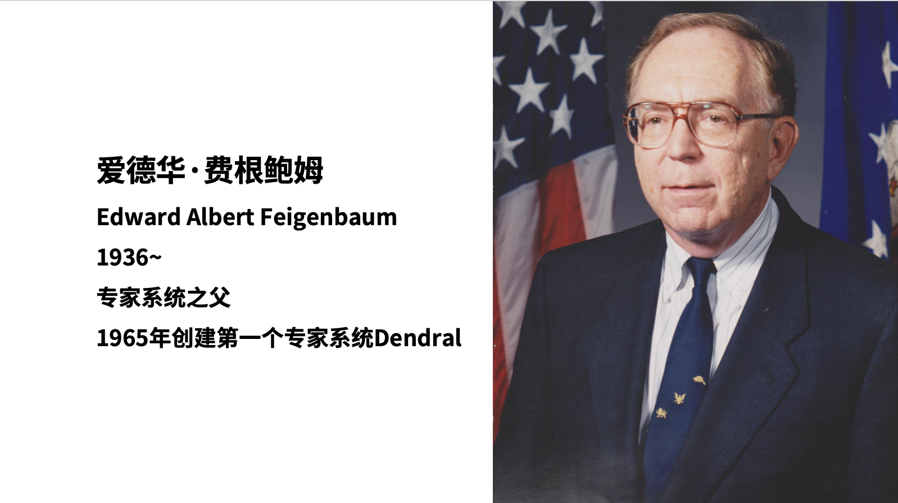
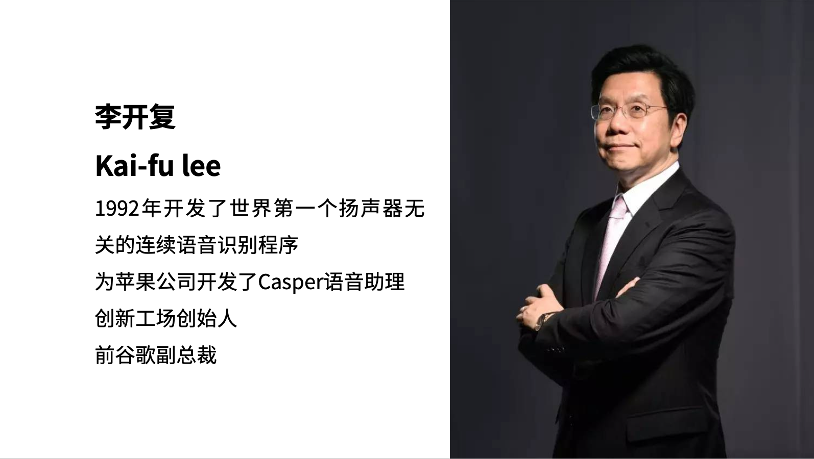
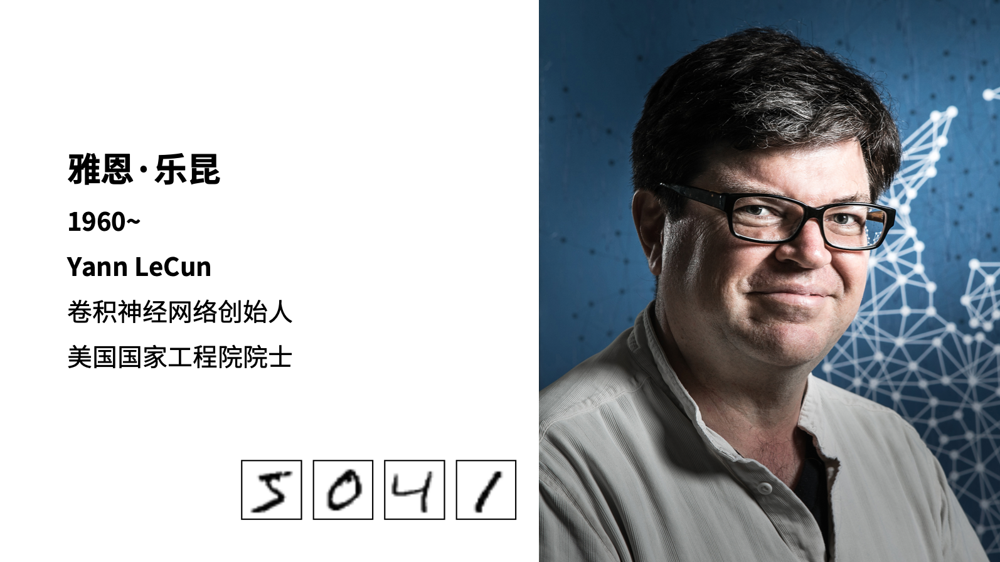
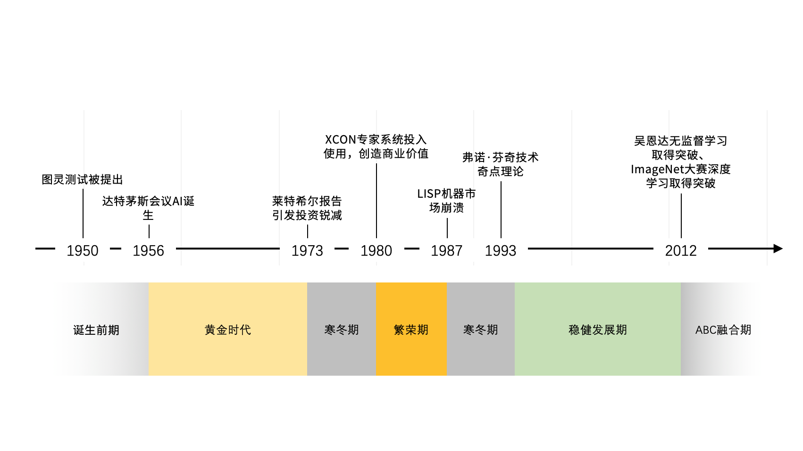

# AI缘起

## 历史浪潮中的AI

人工智能（artificial intelligence）是二十世纪五十年代开始兴起的，旨在赋予机器逻辑推理能力的研究。

 

* 推理期

  这一阶段的代表工作主要有A.Newell和H.Simon的“逻辑推理家”程序以及此后的“通用问题求解”程序等，这些工作在当时取得了令人振奋的结果

   

* 知识期

  E.A.Feigenbaum等人认为，要使机器智能，就必须使其拥有知识，在他们的倡导下，从二十世纪七十年代中期开始，进入“知识期”。在这一时期，大量专家系统问世，在很多应用领域取得了大量成果。

   

* 学习期

  图灵在1950年关于图灵测试的文章中提到过机器学习的可能，二十世纪五十年代初已经有了机器学习的相关研究。五十年代中后期，基于神经网络的“连接主义”学习开始出现。六十年代，基于逻辑表示的“符号主义”学习技术蓬勃发展。
  
   

## AI大事记

### 1950 《计算机器与智能》Alan Mathison  Turing

图灵被称为计算机科学之父，也是人工智能科学之父。二战期间，他的团队在1943年研制成功了被叫做“巨人”的机器，用于破解德军的密码电报，这一贡献让二战提前2年结束，挽救了数千万人的生命。

艾伦图灵对后世最大的理论贡献之一就是**图灵机**。如图中所示，盒子在带有符号的轨道上行进，读取轨道当前符号，然后根据盒子里面的程序对当前符号和盒子里的数字进行计算，得到新的数字并记录到盒子里，然后盒子就会根据这个数字前进或者后退，到达新的轨道位置后再次读取轨道上的符号进行计算，以此类推。

图灵的另一个伟大理论贡献是**图灵测试**，至今仍然被当做人工智能水平的重要测试标准之一。
图灵测试是指，人们通过设备和另外一个人进行聊天，可以是文字形式也可以是语音，这不重要。重要的是聊天之后，如果30%的人认为是在和一个真人聊天，而实际对方却是个机器，那么我们就认为这个机器通过了图灵测试，它是具有智能的。

### 1956 达特茅斯会议

1956年，一群科学家聚会在美国汉诺思小镇宁静的达特茅斯学院，他们试图利用暑假期间的两个月进行封闭式的讨论和研究，而这次会议的主题就是“达特茅斯夏季人工智能研究计划”。

虽然这个会议实际只进行了一个多月，也没产生什么具有影响力的研究成果，但是这个会议首次正式提出人工智能一词，Artificial Intelligence，AI，一直被沿用至今，所以此次会议也就被认为是人工智能正式诞生的元年了。

### 1956-1974 人工智能的黄金时代

这个阶段诞生了世界上第一个聊天程序ELIZA，它是由麻省理工学院的人工智能学院在1964到1966年期间编写的，能够根据设定的规则，根据用户的提问进行模式匹配，然后从预先编写好的答案库中选择合适的回答。
这也是第一个尝试通过图灵测试的软件程序，ELIZA曾模拟心理治疗医生和患者交谈，在首次使用的时候就骗过了很多人。
“对话就是模式匹配”，这是计算机自然语言对话技术的开端。

1959年，计算机游戏先驱亚瑟塞缪尔在IBM的首台商用计算机IBM 701上编写了西洋跳棋程序，这个程序顺利战胜了当时的西洋棋大师罗伯特尼赖。

在这个黄金时代里，约翰麦卡锡开发了LISP语音，成为以后几十年来人工智能领域最主要的编程语言；马文闵斯基对神经网络有了更深入的研究，也发现了简单神经网络的不足；多层神经网络、反向传播算法开始出现；专家系统也开始起步；第一台工业机器人走上了通用汽车的生产线；也出现了第一个能够自主动作的移动机器人。

### 1974-1980 第一次寒冬

1973年，著名数学拉特希尔家向英国政府提交了一份关于人工智能的研究报告，对当时的机器人技术、语言处理技术和图像识别技术进行了严厉的批评，尖锐的指出人工智能那些看上去宏伟的目标根本无法实现，研究已经完全失败。此后，科学界对人工智能进行了一轮深入的拷问，使AI的遭受到严厉的批评和对其实际价值的质疑。
随后，各国政府和机构也停止或减少了资金投入，人工智能在70年代陷入了第一次寒冬。

这次寒冬不是偶然的。在人工智能的黄金时代，虽然创造了各种软件程序或硬件机器人，但它们看起来都只是“玩具”，要迈进到实用的工业产品，科学家们确实一些遇到了不可战胜的挑战。

让科学家们最头痛的就是虽然很多难题理论上可以解决，看上去只是少量的规则和几个很少的棋子，但带来的计算量增加却是惊人的增长，实际上根本无法解决。就像26个字母魔法般的组合成数万个单词，进而在不同语境下组合成无限种句子。比如运行某个有2的100次方个计算的程序，即使用现在很快的计算机也要计算数万亿年，这是不可想象的。

人工智能还需要大量的人类经验和真实世界的数据，要知道即使一个三岁婴儿的智能水平，也是观看过数亿张图像之后才形成的。由于当时计算机和互联网都没有普及，或者如此庞大数据是不可能的任务。

专家系统在这个时代的末尾出现，并开启了下一个时代。
1978年，卡耐基梅隆大学开始开发一款能够帮助顾客自动选配计算机配件的软件程序XCON，并且在1980年真实投入工厂使用，这是个完善的专家系统，包含了设定好的超过2500条规则，在后续几年处理了超过80000条订单，准确度超过95%，每年节省超过2500万美元。

### 1980-1987 繁荣期

1980年卡耐基梅隆大学（CMU）研发的XCON正式投入使用，这成为一个新时期的里程碑，专家系统开始在特定领域发挥威力，也带动整个人工智能技术进入了一个繁荣阶段。

专家系统的起源可以追溯到黄金时代，1965年，在斯坦福大学，美国著名计算机学家费根鲍姆带领学生开发了第一个专家系统Dendral，这个系统可以根据化学仪器的读数自动鉴定化学成分。

费根鲍姆还是斯坦福大学认知实验室的创始人，70年代在这里还开发了另外一个用于血液病诊断的专家程序MYCIN（霉素），这可能是最早的医疗辅助系统软件。

专家系统其实就是一套计算机软件，它往往聚焦于单个专业领域，模拟人类专家回答问题或提供知识，帮助工作人员作出决策。它一方面需要人类专家整理和录入庞大的知识库（专家规则），另一方面需要计算机科学家编写程序，设定如何根据提问进行推理找到答案，也就是推理引擎。

### 1987-1993 第二次寒冬

虽然LISP机器逐渐取得进展，但同时80年代也正是个人电脑崛起的时间，IBM PC和苹果电脑快速占领整个计算机市场，它们的CPU频率和速度稳步提升，越来越快，甚至变得比昂贵的LISP机器更强大。
直到1987年，专用LISP机器硬件销售市场严重崩溃，人工智能领域再一次进入寒冬。

专家系统最初取得的成功是有限的，它无法自我学习并更新知识库和算法，维护起来越来越麻烦，成本越来越高。以至于很多企业后来都放弃陈旧的专家系统或者升级到新的信息处理方式。

1988年，美国科学家朱迪亚·皮尔将概率统计方法引入人工智能的推理过程中，这对后来人工智能的发展起到了重大影响。

IBM的沃森研究中心把概率统计方法引入到人工智能的语言处理中，Candide项目基于200多万条语句实现了英语和法语之间的自动翻译。同年，英国人工智能科学家卡朋特开发了Jabberwacky聊天程序，尝试更好的通过图灵测试，至今这个程序的后续版cleverbot仍然很多人在使用。

1992年，当时在苹果公司任职的华人李开复，他使用统计学的方法，设计开发了具有连续语音识别能力的助理程序，Casper，这也是二十年后Siri最早的原型。Casper可以实时识别语音命令并执行计算机办公操作，类似于语音控制做word文档。

1989年，AT＆T贝尔实验室的雅恩·乐昆和团队使用卷积神经网络技术，实现了人工智能识别手写的邮政编码数字图像。

### 1993-2011 稳健时代

1993年，美国科幻小说作家弗诺·芬奇发布了《即将到来的奇点》一文，三十年内我们将发明超越人类的智能，人类社会将被终结。

1995年，理查德华莱士收到60年代聊天程序ELIZA的启发，开发了新的聊天机器人程序Alice，它能够利用互联网不断增加自身的数据集，优化内容。
虽然Alice也并不能真的通过图灵测试，但它的设计思想影响深远，2013年奥斯卡获奖影片《her（她）》就是以Alice为原型创作的。

90年代最具轰动的莫过于1997年，IMB的计算机深蓝Deep blue战胜了人类世界象棋冠军卡斯帕罗夫。
实际上，在1996年，深蓝就曾经与卡斯帕罗夫对战，但并没有取胜，还受到卡斯帕罗夫的嘲笑，它认为计算机下棋缺乏悟性，永远不会战胜人类。

1997年，两位德国科学霍克赖特和施米德赫伯 提出了长期短期记忆（LSTM） 这是一种今天仍用于手写识别和语音识别的递归神经网络，对后来人工智能的研究有着深远影响。

2007年，在斯坦福任教的华裔科学家李飞飞，发起创建了ImageNet项目。
为了向人工智能研究机构提供足够数量可靠地图像资料，ImageNet号召民众上传图像并标注图像内容。

华裔科学家吴恩达及其团队在2009年开始研究使用图形处理器（GPU而不是CPU）进行大规模无监督式机器学习工作，尝试让人工智能程序完全自主的识别图形中的内容。

2012年，吴恩达取得了惊人的成就，向世人展示了一个超强的神经网络，它能够在自主观看数千万张图片之后，识别那些包含有小猫的图像内容。这是历史上在没有人工干预下，机器自主强化学习的里程碑式事件。

### 2012至今

2008以后，随着移动互联网技术、云计算技术的爆发，积累了历史上超乎想象的数据量，这为人工智能的后续发展提供了足够的素材和动力。

2014年，伊恩·古德费罗提出GANs生成对抗网络算法，这是一种用于无监督学习的人工智能算法，这种算法由生成网络和评估网络构成，以左右互搏的方式提升最终效果，这种方法很快被人工智能很多技术领域采用。

2016年和2017年，谷歌发起了两场轰动世界的围棋人机之战，其人工智能程序AlphaGo连续战胜曾经的围棋世界冠军韩国李世石，以及现任的围棋世界冠军中国的柯洁。

