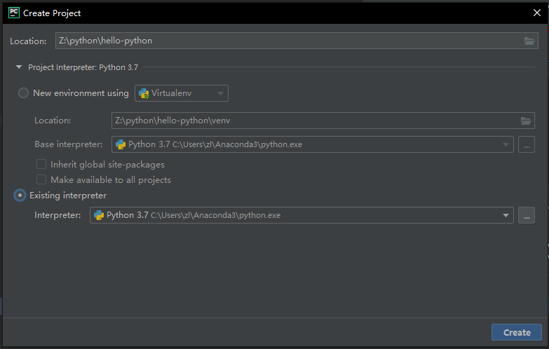
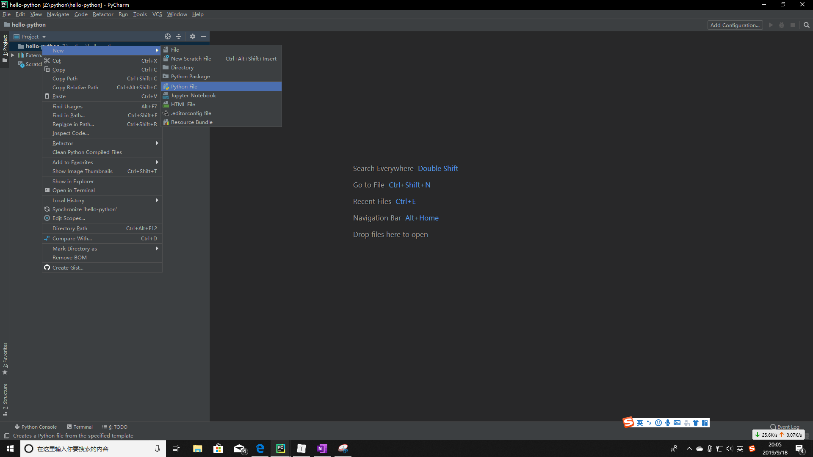
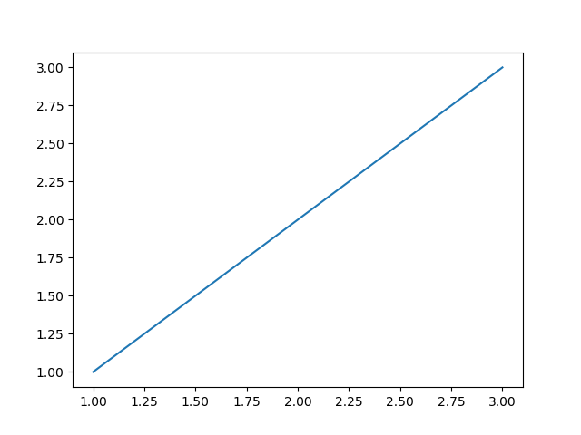

# 研究方法

## 使用的编程语言---Python

做为当下最流行的AI模型编程语言，Python拥有无与伦比的第三方库资源，以及它容易上手，语言简洁易懂。所以这里我们用它。

### 准备开发环境

#### Anaconda 安装

从官网上下载最新版本：https://www.anaconda.com/distribution/

直接安装默认设置。

验证安装成功：

win+R打开运行窗口 ---> 输入cmd ---> 键入`conda -V`并回车

打印出当前conda版本号就说明安装成功了。

接着键入`python`并回车

依次输入

```python
import numpy
import os
import pandas
print("hello world")
```

回车

打印`hello world`说明基础包安装成功


#### PyCharm 安装

从官网下载最新版本（免费版就可以）：http://www.jetbrains.com/pycharm/

直接安装默认设置。

简单使用：

* 新建项目：File ---> New Project 

  注意 Location 是你的项目文件夹所在位置。

  使用 New environment using Virtualenv 会在 Location 路径下新建一个虚拟的十分干净的 Python 环境。

  使用 Existing interpreter，默认情况下会找到你安装 Anaconda 的路径。我们这里选这个。



* 新建文件：在右侧 Project 窗口中右击新建 Python File 新建一个Python文件

  

* 在编辑窗口中输入下面的代码

  ```python
  import matplotlib.pyplot as plt
  
  x = [1, 2, 3]
  y = [1, 2, 3]
  
  plt.plot(x, y)
  plt.show()
  ```

  然后 shift + F10 运行代码，输出如下图片。

  

  这是最简单的画图程序的写法，后面我们会详细介绍图表的制作。

  

## 数据集

假设我们已经有了一个干净有效的数据集。^w^

* 训练集：用于模型训练
* 验证集：用于模型验证
* 测试集：用于评估模型效果

思考：为什么我们需要拆分成这样三个数据集？

