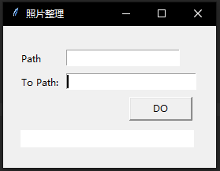
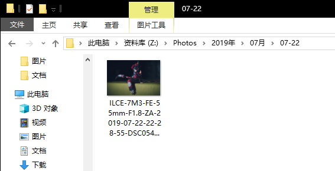

# Python 入门

## 一 面向对象编程

虽然是入门教程，但是我还是想先从面向对象说起。

面向对象编程是一种编程思想，强调对事物的抽象，基于抽象的概念，可以构造出各种设计模式。面向对象编程的一个好处就是有利于代码的复用，有利于到底高内聚低耦合的目标。在一个大型的项目中，一般会要求使用这种思想，因为如果抽象不够好的话，很有可能造成代码大量的重复、耦合，如此一来，整个项目会变得异常臃肿和复杂，以致于后续更新异常艰难。

比如说我们想做一个整理照片的程序。首先，这个程序的名字应该符合我们的功能，就叫它ImageArranger。然后想一下需要什么功能。最开始，它应该是一个界面，我可以输入我想要整理的目录和我想要输出整理结果的目录，然后需要有一个按钮执行操作。并且，它应该可以找到需要的文件然后复制到归档的目录中，并且重新命名。

```python
class ImageArranger:
    def __init__(self):
        self.__window = tkinter.Tk()
        self.__file_path_label = tkinter.Label(self.__window, text="Path")
        self.__file_path = tkinter.Entry(self.__window)
        self.__to_path_label = tkinter.Label(self.__window, text="To Path:")
        self.__to_path = tkinter.Entry(self.__window, width=23)
        self.__bot = tkinter.Button(self.__window, text="DO", command=self.__action, width=10)
        self.__canvas = tkinter.Canvas(self.__window, width=220, height=22, bg="white")
        self.__init_window()
    
    def __init_window(self):
        self.__window.geometry("270x180")
        self.__window.title("照片整理")
        self.__file_path_label.place(x=20, y=30)
        self.__file_path.insert(10, "Z:/照片/sakura")
        self.__file_path.place(x=80, y=30)
        self.__to_path_label.place(x=20, y=60)
        self.__to_path.insert(10, "Z:/Photos/")
        self.__to_path.place(x=80, y=60)
        self.__bot.place(x=160, y=90)
        self.__canvas.place(x=20, y=130)

    @staticmethod
    def __get_exif_data(fname):
        """Get embedded EXIF data from image file."""
        ret = {}
        try:
            img = Image.open(fname)
            if hasattr(img, '_getexif'):
                exifinfo = img._getexif()
                if exifinfo != None:
                    for tag, value in exifinfo.items():
                        decoded = TAGS.get(tag, tag)
                        ret[decoded] = value
        except IOError:
            print('IOERROR ' + fname)
        return ret

    @staticmethod
    def __get_file_names(file_path):
        result = []
        for root, dirs, files in os.walk(file_path):
            for file in files:
                if file.split('.')[1] == 'jpg' or file.split('.')[1] == 'JPG':
                    result.append(os.path.join(root, file))
        return result

    def __action(self):
        file_path_attr = self.__file_path.get()
        to_path_attr = self.__to_path.get()
        file_names = self.__get_file_names(file_path_attr)
        fill_line = self.__canvas.create_rectangle(1.5, 1.5, 0, 23, width=0, fill="white")
        self.__canvas.coords(fill_line, (0, 0, 220, 60))
        self.__window.update()
        fill_line = self.__canvas.create_rectangle(1.5, 1.5, 0, 23, width=0, fill="green")
        pic_number = len(file_names)
        handled_pic = 0

        print('%s photos to arrange' % pic_number)
        for pic in file_names:
            handled_pic = handled_pic + 1
            n = handled_pic / pic_number * 220
            self.__canvas.coords(fill_line, (0, 0, n, 60))
            self.__window.update()
            try:
                exif = self.__get_exif_data(pic)
                if exif == {}:
                    continue
                if 'Model' not in exif.keys():
                    continue
                camera = exif['Model']
                if 'LensModel' in exif.keys():
                    lens = exif['LensModel']
                else:
                    lens = 'unknown'
                if 'DateTimeOriginal' not in exif.keys():
                    continue
                time = exif['DateTimeOriginal']
                date = time[:10]
                year, month, day = date.split(':')
                new_path_root = '%s/%s年/%s月/%s-%s' % (to_path_attr, year, month, month, day)
                if not os.path.exists('%s/%s年/' % (to_path_attr, year)):
                    os.mkdir('%s/%s年/' % (to_path_attr, year))
                if not os.path.exists('%s/%s年/%s月' % (to_path_attr, year, month)):
                    os.mkdir('%s/%s年/%s月' % (to_path_attr, year, month))
                if not os.path.exists(new_path_root):
                    os.mkdir(new_path_root)

                old_name = os.path.split(pic)[1]
                new_name = (camera + '-' + lens + '-' + time + '-' + old_name).replace(' ', '-').replace(':',
                                                                                                         '-').replace(
                    '/', '')
                new_path = os.path.join(new_path_root, new_name)
                if not os.path.exists(new_path):
                    shutil.copyfile(pic, new_path)
            except ValueError or IOError:
                continue

    def start(self):
        self.__window.mainloop()
```

要运行这个应用只要：

```python
if __name__ == '__main__':
    arranger = ImageArranger()
    arranger.start()
```

我们通过`ImageArranger()`创建一个`ImageArranger`对象，然后调用`start()`方法运行这个应用。

然后你会看到窗口弹出



输入需要整理的目录和输出目录，点击DO就可以整理照片了。照片会按照年份/月份目录进行分类，然后重命名。



